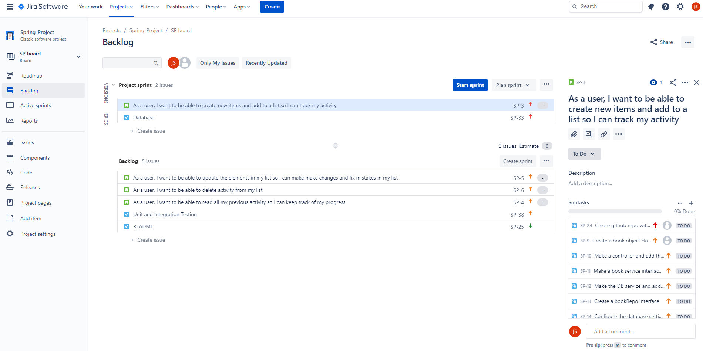
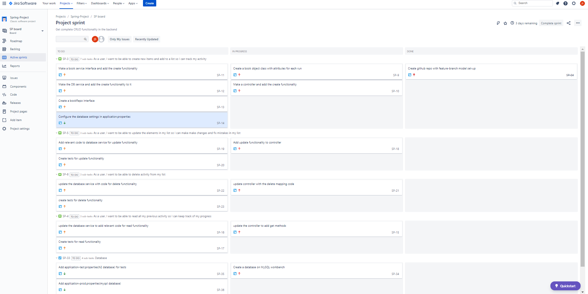
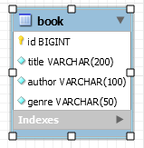

# SPRING-FRONTEND

## Table of contents

- [Introduction](#Introduction)
- [Project Scope](#Project-Scope)
- [Technology constraints](#Technology-constraints)
- [Kanban Board](#Jira-Board)
- [Version Control](#Version-control)
- [Data Persistence](#Data-Persistence)
- [Testing](#Testing)
- [Areas for improvememt](#Areas-for-improvement)
- [Conclusion](#Conclusion)

## Introduction

The objectives of this project was to create CRUD (Create, Read, Update, Delete) application by incorporating Spring (Java framework) for creating the backend, and Javascript, HTML and CSS for the frontend. This README will act as documentation for the project and how the different components of the project came together through project planning, code execution and testinng and evaluating.

## Project Scope

The scope of the project outlines the minimum requirements for successful completion of the deliverable which will help assess our development against the SFIA marking framework.

- Project tracking and planning was carried out via a kanban style board, allowing the documentation of user stories, product backlog and progression. The board for this project can be found [here](https://junaid95.atlassian.net/secure/RapidBoard.jspa?rapidView=3&projectKey=SP&selectedIssue=SP-38)

- Use of the feature-branch model for optimal version control, allowing for a safe and effective way of making changes to the source code.

- A relational database used for the for the persistence of data.

- A functional application created using Java as the OOP language, following best practices and design principles.

- A front-end with an integrated API for the application that allows users to create, read, update and delete.

- Test suite with maximum coverage and automated testing for validatio of the application.

## Technology Constraints

- Kanban Board: Jira
- Version Control: Git and github
- Backend API: Java (Spring framework)
- Frontend: HTML/CSS/JavaScript
- Database: MySQL/H2 database
- Test suite: JUnit
- IDE: Eclipse (backend)/VSCode(frontend)

## Jira Board

A kanban board was used to manage workflow and keep on top of tasks that were to be completed in order to successfully complete the project. Agile methodologies were implemented where applicable as set out in the brief. For example, having a sprint backlog and defining user stories. Due to the solo nature of the project, a lot of the scrum framework could not be implemented. MoSCow prioritisation was implemented in the kanban board, where everything labelled red was deemed to be high priority as these tasks were necessary to progressing effectively through the project. As the tasks were completed the were transferred along the kanban board, giving a good visual representation of progress throughout the project.

### Initial Jira Board

### Ongoing Jira Board

## Entity Relationship Diagram

This is the structure of the table that I used for data storage and persistence from my application.

